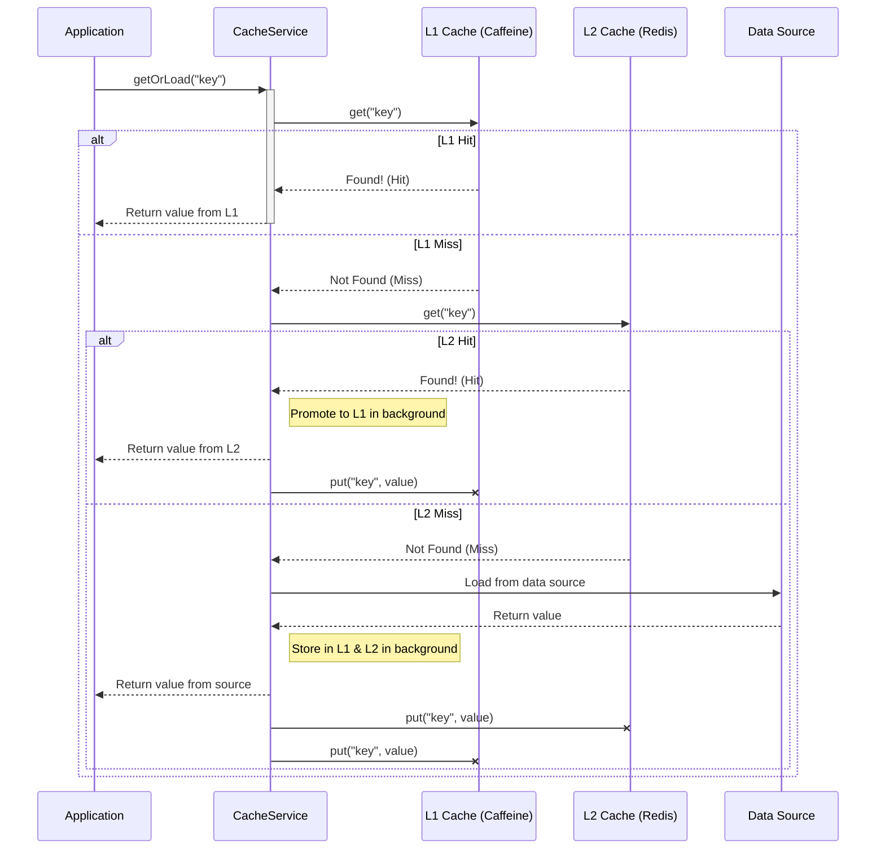
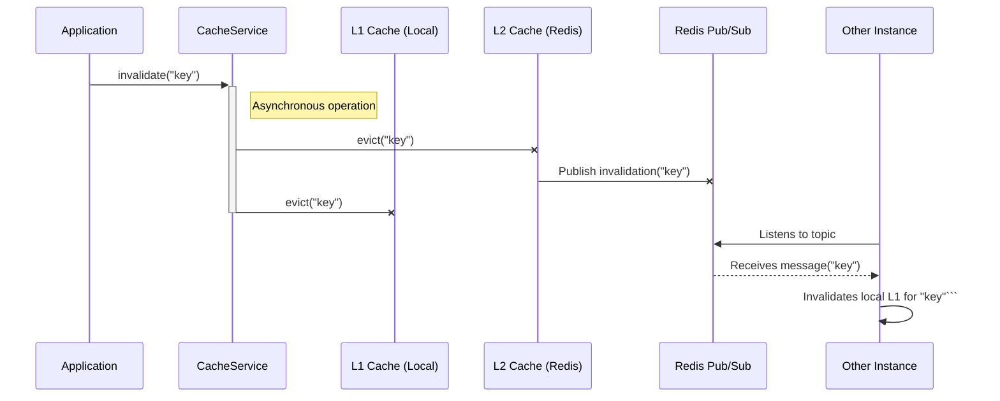

# Caching-X: High-Performance, Resilient, Multi-Level Caching for Java


**Caching-X** is a powerful, type-safe, and resilient multi-level caching library for modern Java applications. It elegantly combines a lightning-fast L1 in-memory cache with a scalable L2 distributed cache, providing an intelligent, production-ready solution out of the box.

## Table of Contents

- [Why Caching-X?](#why-caching-x)
- [Key Features](#key-features)
- [Quick Start in 3 Steps](#quick-start-in-3-steps)
- [How It Works (Architecture)](#how-it-works-architecture)
- [Using the API: A Deeper Look](#using-the-api-a-deeper-look)
- [Advanced Features](#advanced-features)
- [Modules](#modules)
- [Contributing](#contributing)

## Why Caching-X?

Managing multiple cache layers is complex. Our philosophy is to abstract this complexity away, providing an intelligent, production-ready strategy that just works. We are built on four pillars:

-   **⚡ Performance**: Sub-millisecond L1 hits and optimized L2 access with intelligent cache promotion.
-   **🛡️ Resilience**: Integrated circuit breakers and graceful degradation ensure your application remains stable, even if a cache layer fails.
-   **🧩 Simplicity**: A clean, developer-friendly API with both declarative (`@CacheX`) and programmatic approaches.
-   **🔒 Security**: A secure-by-default design that prevents common deserialization vulnerabilities.

## Key Features

-   **Multi-Level Caching**: Combines L1 (Caffeine) and L2 (Redis) for optimal performance.
-   **Annotation-Driven**: Use `@CacheX` for clean, declarative caching with full SpEL support.
-   **Intelligent Cache Promotion**: L2 hits are automatically promoted to L1, accelerating future access.
-   **Distributed Invalidation**: Redis Pub/Sub keeps data consistent across all application instances.
-   **Full Type Safety**: A generic-aware API using `ParameterizedTypeReference` to prevent `ClassCastException`.
-   **Null Value Caching**: Prevents "cache stampede" issues by caching null results from your data source.
-   **Asynchronous Operations**: All cache writes and invalidations are non-blocking.
-   **Circuit Breaker Protection**: Built-in Resilience4j protects against L2 failures.
-   **Comprehensive Metrics**: Deep observability via Micrometer and a custom `/actuator/cachex` endpoint.

## Quick Start in 3 Steps

Integrate Caching-X into any Spring Boot project in minutes.

### Step 1: Add the Dependency

Add the Caching-X starter to your `pom.xml`:

```xml
<dependency>
  <groupId>com.pedromossi</groupId>
  <artifactId>caching-x</artifactId>
  <version>0.0.3</version>
</dependency>
```

### Step 2: Configure `application.yml`

Set up your Redis connection and define your cache layers.

```yaml
spring:
  data:
    redis:
      host: localhost
      port: 6379

# Configure Caching-X
caching:
  enabled: true
  l1:
    # Caffeine specification for L1 in-memory cache
    spec: "maximumSize=1000,expireAfterWrite=5m"
  l2:
    # TTL for L2 distributed cache (Redis)
    ttl: PT30M # ISO-8601 duration format
```

### Step 3: Use It in Your Code

Caching-X offers two primary APIs. We recommend starting with `@CacheX` for its simplicity and clean separation of concerns.

#### Option A: Declarative Caching with `@CacheX` (Recommended)

This is the cleanest approach for most use cases. It keeps caching logic separate from your business code.

```java
@Service
public class ProductService {
    
    @CacheX(key = "'product:' + #productId")
    public Product getProduct(String productId) {
        // The result is cached automatically by the library.
        return productRepository.findById(productId).orElse(null);
    }
    
    @CacheX(key = "'product:' + #product.id", operation = CacheX.Operation.EVICT)
    public void updateProduct(Product product) {
        // The cache is evicted automatically after this method succeeds.
        productRepository.save(product);
    }
}
```

#### Option B: Programmatic Caching with `CacheService`

Use the `CacheService` directly when you need more granular control over key generation or the loading logic.

```java
@Service
public class ProductService {

    @Autowired
    private CacheService cacheService;
    
    public Product getProduct(String productId) {
        return cacheService.getOrLoad(
            "product:" + productId,
            Product.class,
            () -> productRepository.findById(productId).orElse(null)
        );
    }
    
    public void updateProduct(Product product) {
        productRepository.save(product);
        cacheService.invalidate("product:" + product.getId());
    }
}
```


## How It Works (Architecture)

### Read Flow (`getOrLoad`)

Caching-X follows a clear and optimized data lookup strategy: **L1 -> L2 -> Data Source**.


<details>
<summary>View Mermaid Code</summary>



</details>

### Invalidation Flow (`invalidate`)

Invalidation is propagated across all instances via Redis Pub/Sub to ensure data consistency.


<details>
<summary>View Mermaid Code</summary>


</details>

## Using the API: A Deeper Look

### Annotation-Based Caching with `@CacheX`

`@CacheX` is the preferred way to implement caching. It keeps your code clean and your caching logic declarative.

-   **Operations**: Supports `GET` (default) to cache results and `EVICT` to invalidate them after method execution.
-   **SpEL Support**: Use Spring Expression Language for powerful, dynamic cache keys.
-   **Type Safety**: Automatically infers the return type, including complex generics like `List<User>`.

#### Key Expression Examples:

```java
// Method parameters
@CacheX(key = "'user:' + #userId")

// Object properties
@CacheX(key = "'order:' + #order.id + ':status'")

// Method calls and multiple parameters
@CacheX(key = "'search:' + #query.hashCode() + ':' + #page")

// Static keys
@CacheX(key = "'global:settings'")
```

### Programmatic Caching with `CacheService`

For complex scenarios, inject the `CacheService` for full control. This is ideal when key generation logic is non-trivial or the loader function requires complex setup. To ensure type safety with generics, always use `ParameterizedTypeReference`.

```java
List<Product> products = cacheService.getOrLoad(
    "products:featured", 
    new ParameterizedTypeReference<List<Product>>() {},
    () -> productRepository.findFeatured()
);
```

## Advanced Features

Caching-X is packed with production-ready features that are auto-configured for you.

-   **🛡️ Resilience with Circuit Breaker**: Protects your app from a slow or failing Redis. When the L2 cache is unhealthy, the circuit breaker opens, and your application gracefully degrades to using L1 and the data source, ensuring stability. Recovery is automatic.

-   **🔒 Secure by Default**: Our Redis adapter **does not** use `ObjectMapper`'s `activateDefaultTyping`, which prevents RCE (Remote Code Execution) vulnerabilities from malicious payloads. Type safety is guaranteed by `ParameterizedTypeReference`.

-   **📊 Comprehensive Observability**: Gain deep insights into your cache performance with our dual-layer metrics system and an interactive actuator endpoint.
    

> For detailed configuration of these features, see the **[caching-spring-boot-starter/README.md](caching-spring-boot-starter/README.md)**.

## Modules

The project is organized into a clean, multi-module structure. Click on a module to learn more about its specific role and configuration.

-   [**`caching-core`**](./caching-core/README.md): Defines the core interfaces (`CacheService`, `CacheProvider`) and contains the main `MultiLevelCacheService` implementation.
-   [**`caching-caffeine-adapter`**](./caching-caffeine-adapter/README.md): A high-performance L1 cache adapter using Caffeine.
-   [**`caching-redis-adapter`**](./caching-redis-adapter/README.md): A resilient L2 cache adapter using Redis.
-   [**`caching-spring-boot-starter`**](./caching-spring-boot-starter/README.md): Provides seamless auto-configuration for Spring Boot applications.

## Contributing

Contributions are welcome! Please feel free to open an issue, fork the repository, and submit a pull request.
